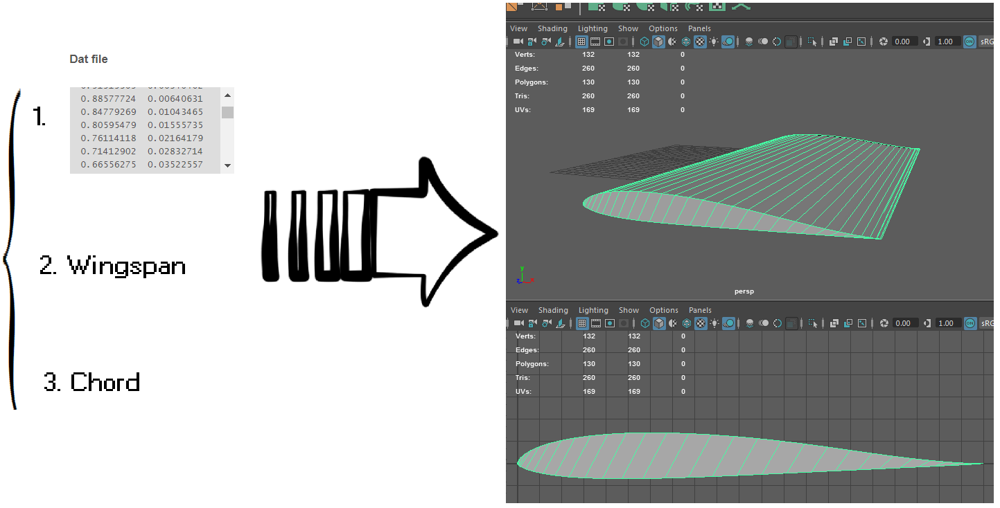

# airfoil2maya
Airfoil generator for Maya!

## What does it do?!

airfoil2maya provides a MEL (Maya Embedded Language) procedure for producing a 3d wing object based on:
* A Selig .dat airfoil (see [Airfoil Tools](http://airfoiltools.com)) 
* Wingspan (**int**, in cm)
* Chord (**int**, in cm)

## Tested on

* Autodesk Maya LT 2016 - Student Version.
* MH45 Selig file from [Airfoil Tools](http://airfoiltools.com).

## Authors

* Leandro Lustosa - [personal website](http://lustosa-leandro.github.io).

## License

This project is licensed under the MIT License -- see the [LICENSE](LICENSE) file for details.
